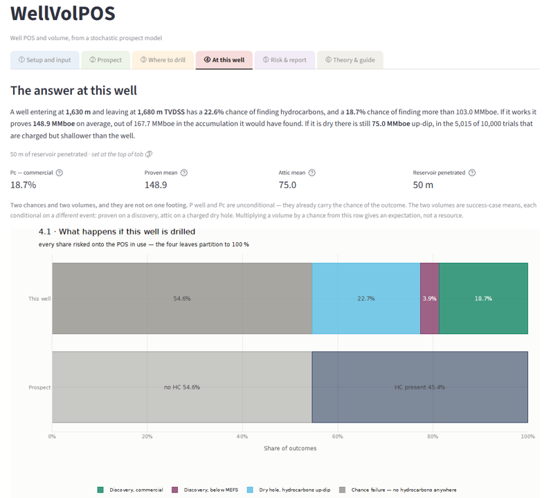
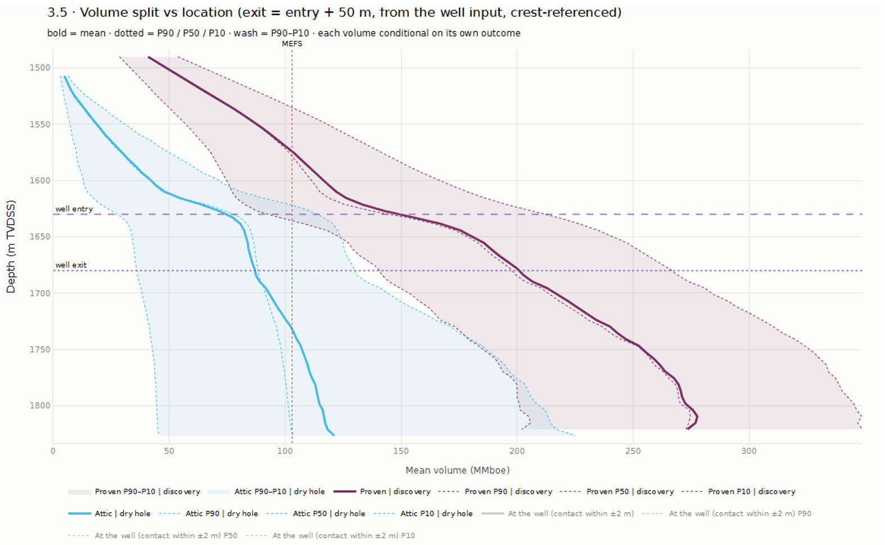
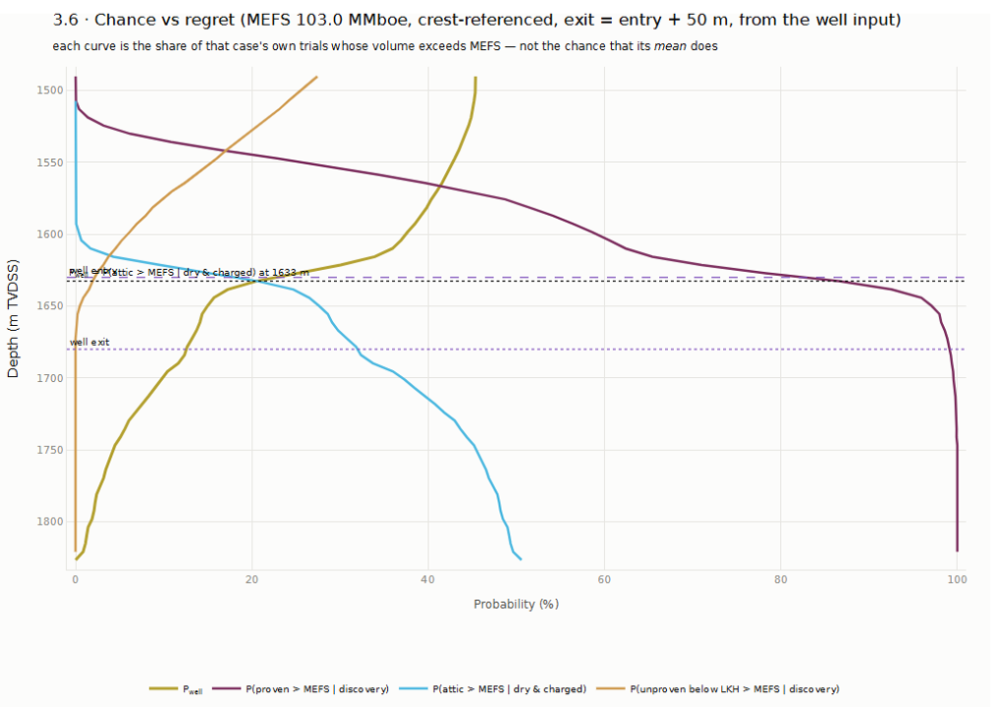
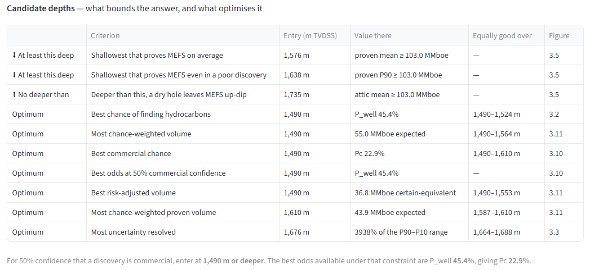
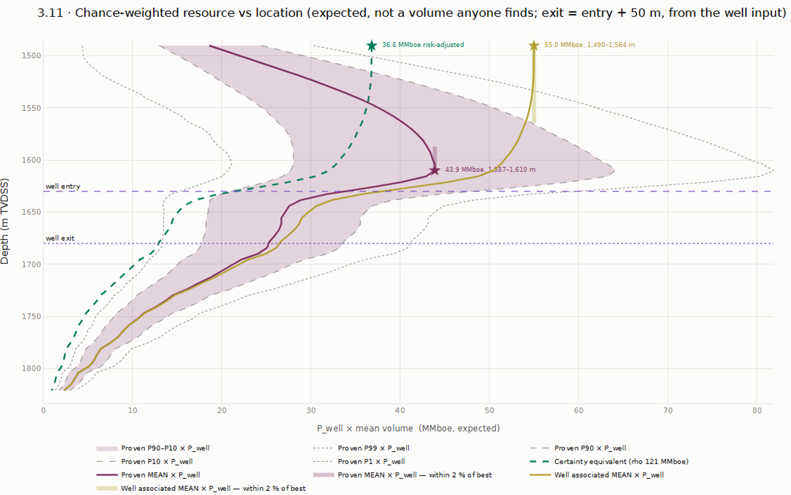
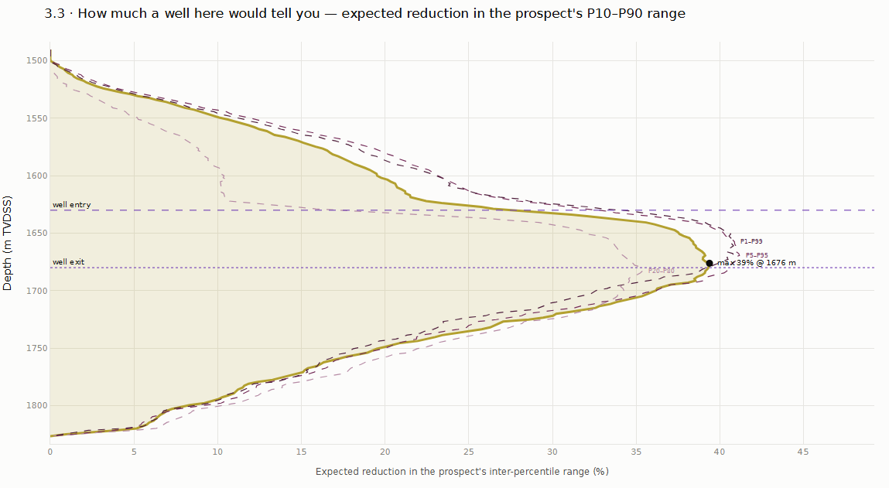
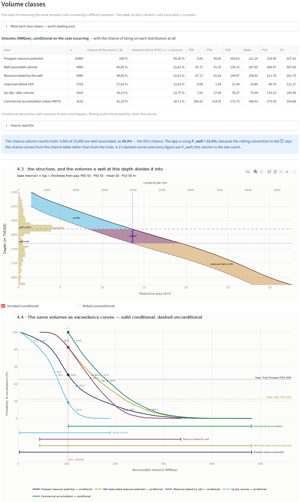
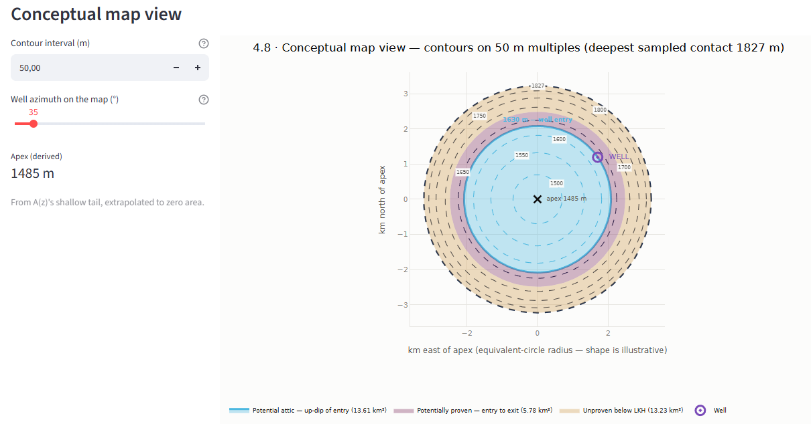

# WellVolPOS

**A prospect has a chance of holding hydrocarbons. A well has a chance of finding
them. They are not the same number.** WellVolPOS takes a stochastic prospect model —
a GeoX run, or any comparable simulation, exported as its trials — and works out what
that model implies for one specific well location: the chance that *this well*
succeeds, what it would prove if it did, and what it would leave behind if it did not.

---

## The problem

A prospect is assessed before anything is drilled: how likely is it that hydrocarbons
are there, and if they are, how much? That produces a probability of success and a
volume distribution, and those numbers travel — into the portfolio, the partner
meeting, the investment case.

Then a well is planned, and someone chooses exactly where it goes. That decision is
often settled later, and often for good reasons unrelated to the subsurface case: rig
schedule, a shallow hazard, standing off a boundary fault, a partner's preference.

So the chance that this well succeeds is not necessarily the same as the chance that
the prospect works. Once the well is positioned below the shallowest possible contact,
the well POS becomes lower — sometimes substantially so — and the difference depends
on where the well is put.

**The well tests a sub-population, not the prospect.** Every trial in the stochastic
model is one possible version of the prospect. A well at a given depth can only
succeed on the subset of versions whose contact lies below it. The remainder are not
failures of the prospect; they are outcomes this particular well could never have
observed. What the tool reports is a conditional probability — the chance of success
*given that you drilled here*.

There is a practical consequence. Drilling down-dip to prove a larger volume lowers
the chance of finding anything. If that lower chance was never written down, a dry
hole gets measured against the prospect number, and the person who assessed the
prospect is the one who appears to have been wrong. The geology may have been sound
and the location may have been sensible; what was missing was the number connecting
them.

---

## The key idea

```
              Prospect stochastic model  (10 000 trials)
                              │
             ┌────────────────┴────────────────┐
             │                                 │
      Prospect POS                   Contact distribution
             │                                 │
             │                          + Well location
             │                                 │
             │                          Location factor
             └────────────────┬────────────────┘
                              │
                          Well POS
```

| | asks |
|---|---|
| **Prospect POS** | Does the prospect contain hydrocarbons? |
| **Location factor** | Given hydrocarbons are present, can this well encounter them? |
| **Well POS** | What is the chance that this particular well succeeds? |

```
Well POS = Prospect POS × Location factor
```

The location factor is the only term the well's position controls; the prospect POS is
the only term it does not. They are reported separately, because a decision needs to
know which part it can still change.

---

## What it calculates

- **Well POS** against the prospect POS, swept across every entry depth, so the cost
  of moving the well is visible rather than inferred.
- **What a discovery would prove** — a well demonstrates the interval it penetrated,
  not the whole accumulation. Each trial is split into proven, unproven below the
  well, and untested up-dip.
- **What a dry hole may have left.** A dry hole does not necessarily mean an uncharged
  prospect. If hydrocarbons were present in a given realisation but the well was
  drilled below their contact, the well may leave an untested volume behind.
- **Chance of exceeding a volume threshold** you supply, as distinct from the chance
  of a discovery of any size. The two favour different locations.
- **The inverse**: name a volume that must be demonstrated, and get the shallowest
  depth that does so, with the chance it costs.
- **A defensible depth window** rather than a single optimum — see below.
- **Attribution** of the location penalty back to charge, closure, reservoir or
  retention, under several conventions that all give the same well POS.

---

## Quick start

```bash
python -m venv .venv && .venv/Scripts/Activate.ps1   # Windows
pip install -r requirements.txt
pytest
streamlit run app.py
```

The app opens on bundled demo data, so there is nothing to prepare. Step-by-step
instructions, with the Windows specifics, are in
[`GETTING_STARTED.md`](GETTING_STARTED.md).

**To use your own trials**, choose *Upload your own…* in tab ①. A GeoX export is
recognised automatically; other formats go through a generic reader that proposes a
column mapping for you to confirm.

**Uploaded files are never written to disk** — the file is read into memory, passed to
the reader, and exists only for that session. Run the app locally and your data never
leaves your machine. On a hosted deployment the bytes sit in that server's memory for
the duration of the session; nothing is stored, but it is somebody else's machine, so
host it yourself if that matters.

---

## What this is not

**WellVolPOS is not a prospect risking tool.** It does not determine whether the
prospect is charged, whether the seal works, or whether the stochastic model is
geologically appropriate. It takes the model as given and evaluates what that model
implies for a specific well location.

A prospect model describes uncertainty in the prospect. WellVolPOS asks what that same
uncertainty means for the particular well you are about to drill.

It also does not model economics. Where a volume threshold appears — MEFS or MCFS —
it is a number you supply, and the resulting `Pc` is the chance of a discovery
exceeding that threshold. It is threshold-based commerciality, not an economic
evaluation, and the threshold is drawn as a reference line rather than applied to the
distributions.

---

## How it works

Each trial in the export is one internally consistent version of the prospect: a
hydrocarbon–water contact, a productive area, a recoverable volume.

**The contact distribution is therefore a key input.** It represents the uncertainty
in how deeply hydrocarbons may extend across the structure. Any geological
dependencies between column height, closure, charge, retention and the other risk
elements must already be represented in the stochastic model. WellVolPOS does not
introduce or re-risk those dependencies; it uses the resulting trial distribution.

At its core, the location calculation is simple: classify the stochastic trials
according to whether the contact lies below the well entry depth.

```
Location factor = P(contact deeper than the well entry | hydrocarbons present)
```

Above the shallowest sampled contact that fraction is one, and the well POS equals the
prospect POS. Below it the fraction falls, and so does the well POS.

The volume side uses the same classification. The area–depth relationship is recovered
from the trials themselves, which is what allows a single trial to be divided at the
well into the part the well would demonstrate and the part it would not.

---

## A defensible drilling window, not a single optimum

Several criteria can all be maximised at the shallowest depth in a sweep, and often
are: high on the structure every charged version of the prospect is a success, so any
criterion that ignores the volume threshold cannot distinguish those depths. A list of
optima then becomes several copies of one number.

The tool therefore leads with a window, bounded by two questions:

| | |
|---|---|
| **Floor** | How deep must the well go to demonstrate the required volume? |
| **Ceiling** | How deep can it go before the chance of leaving a material volume untested becomes unacceptable? |

Both are read as guarantees rather than first crossings. Either bound can be absent,
and that is reported as such. The floor can also come out deeper than the ceiling,
which is a finding about the prospect rather than an error: at that threshold, no
location both demonstrates the required volume and avoids stranding one.

Individual optima are listed underneath — best chance, best chance-weighted volume,
best chance-weighted proven volume, best threshold chance, best risk-adjusted volume,
best odds subject to a confidence constraint, and the appraisal optimum. Each carries
the span of depths within a couple of per cent of its own best, because on a nearly
flat curve a single depth is false precision.

---

## The app

Bundled prospect C, one well, shipped defaults.

| | |
|---|---|
|  | **The answer first.** The four things that can happen. The blue slice is hydrocarbons present but entirely up-dip of the well — recorded as a dry hole, and not a failure of the prospect. |
|  | **What a discovery would prove** rises with depth — and so does what a dry hole would leave behind. |
|  | **Falling chance against rising regret.** Where they cross, being wrong starts to cost more than being right is likely. |
|  | **The window, then the optima.** Several optima share a depth, which is real: high on the structure they cannot be told apart. |
|  | **Chance × volume** peaks in between. The two markers ask different questions — what the accumulation holds, against what the well would establish. |
|  | **An appraisal view**: not what the well finds, but what it settles. It peaks deeper, and refers to no threshold. |
|  | **The volume classes nest**, and the section shows why. On the exceedance curves the two probabilities are where the risked curves begin, so the gap between them is measured rather than asserted. |
|  | **The same split in plan.** The shape is illustrative; the areas and depths are not. |

---

## Conventions you set

Each of these changes the numbers, so each is an explicit setting:

- **Risking convention** — are the trials already risked, or success-case only? Asked
  at import, with the supporting evidence shown.
- **Reference contour** for the location factor — crest/apex, or P90 area.
- **Risk-element allocation** — none, equal cube root, or all to closure. All three
  give the same well POS and differ only in attribution.
- **Assessment minimum** — a minimum column height below the apex.
- **Engine** — whole-trial grouping (after Schneider et al. 2023) or the per-trial
  volume split. Both are shown, and they answer slightly different questions.

---

## Outputs

Tab ⑤ builds four artefacts from one assembled result, so they cannot disagree with
each other or with the screen:

| Format | For |
|---|---|
| **XLSX** | Checking the arithmetic. Values only. |
| **PDF** | The well proposal — a stamped cover page, then every figure in the order the app shows them. |
| **PNG / SVG zip** | Slides. The provenance travels inside the archive. |
| **JSON case** | Reopening a session. Settings only, never results, so a reloaded case cannot show numbers this version would not produce. |

Every artefact carries the same stamp: the prospect POS and its source, the location
factor, the well POS, the well, the reference contour, the allocation scheme and the
threshold volume.

Figures can be drawn with matplotlib (the default, no extra install) or with plotly
via [kaleido](https://pypi.org/project/kaleido/), which reproduces what the app shows
on screen. The numbers are identical either way.

---

## Data

`data/` ships two prospects, both safe to publish.

**Prospect C** is the default: a real export with every depth shifted by one constant,
so the file names no location. A rigid translation changes nothing the tool reports —
column heights are differences, the area–depth curve is the same curve moved — and a
test confirms the invariance. It anonymises *where*, not *how much*.

**Prospect A** is fictional and ships in two export forms, so both the everyday case
and the duplicate-header case stay exercised. One trap worth knowing: the two forms
carry the same trial identifiers attached to different rows, so joining exports on
trial number scrambles them.

`io/synthetic.py` generates further files whose closure is a cone, so the area–depth
relationship is known exactly — useful for checking the reservoir-thickness inversion.

---

## Architecture

```
app.py                       Streamlit entry point — six tabs
wellvolpos/
  io/adapters/               trial-file readers; add a simulator by adding a file
  io/units.py                unit validation
  io/failure.py              chance-failure detection
  io/qc.py                   import quality control
  io/anonymise.py            depth-shift an export so it can be published
  core/structure.py          area–depth curve, recovered from the trials
  core/groups.py             whole-trial grouping (Schneider et al. 2023)
  core/classes.py            per-trial volume split
  core/summary.py            headline, drilling window, optima
  core/mefs.py               volumes read against the threshold
  core/dependence.py         what the exit depth moves; well-geometry check
  core/utility.py            certainty equivalent, confidence constraint
  core/chance.py             location factor, reference contours, risk allocation
  core/reservoir.py          reservoir thickness, back-calculated from pay
  core/rose.py               No Regrets, Pmcfs(well), Pc(well)
  core/sweep.py              depth sweeps and the inverse
  core/stats.py              bootstrap and Wilson intervals
  viz/theme.py               palette, styling, the depth-axis rule
  viz/interactive.py         plotly figures — what the app draws
  viz/figures.py             matplotlib twins — what the export draws
  report/export.py           one result, four formats
  report/guide.py            theory & guide tab
data/                        demo trial files
docs/screenshots/            images used by this README
tests/                       test suite, including parity against the source workbook
```

---

## References

- Schneider, M., Citron, G.P., Haryott, P. & Cook, D. (2023) *Drilling an exploration
  prospect downdip.* AAPG Bulletin 107(5): 743–759.
  [doi:10.1306/09232222051](https://doi.org/10.1306/09232222051) — open access.
- Milkov, A.V. (2021) *Reporting the expected exploration outcome.* J. Pet. Sci. Eng.
  204: 108754. [doi:10.1016/j.petrol.2021.108754](https://doi.org/10.1016/j.petrol.2021.108754)
- Haskett, W.J. (2003) *Optimal appraisal well location…* SPE 84241.
- Hood, K.C. (2024) *Hydrocarbon column heights, Parts 1–2.* Rose & Associates.

Tab ⑥ lists every source, with whether it was read directly or cited through another
work.

## Licence

MIT.
